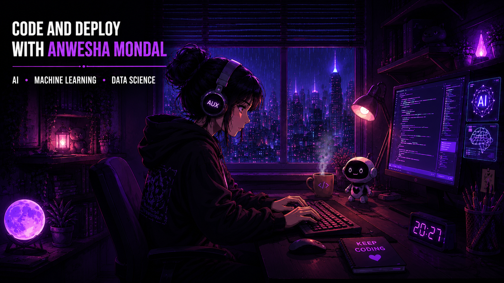

  

  

 

# Hello, I'm Anwesha Mondal

### Building intelligent solutions through AI, curiosity & code 💜

---

## 🛠️ Skills

| Category | Skills |
| :--- | :--- |
| **Languages** |       |
| **AI / Machine Learning** |        |
| **Data Science** |     |
| **Frontend** |         |
| **Backend & Systems** |         |
| **Databases & Storage** |      |
| **DevOps, Testing & Tools** |         |
| **Core Computer Science** |      |

---

> *"Every great innovation begins with curiosity and a single line of code."* ✨

